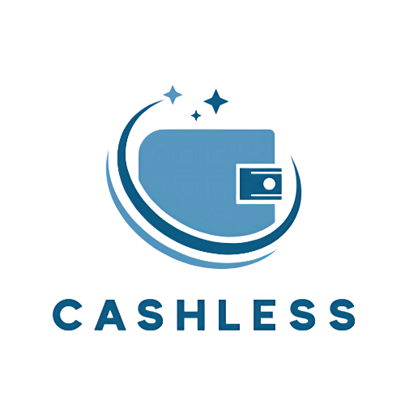
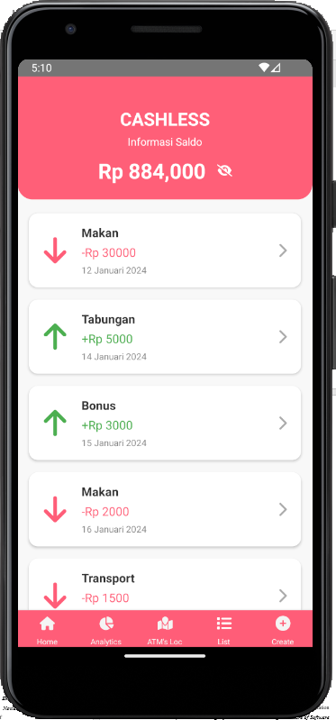

# CashLess - Aplikasi E-Wallet untuk Pendataan Keuangan



## Latar Belakang
Kegiatan manusia saat ini dipermudah dengan adanya teknologi smartphone yang lebih fleksibel dibawa kemana saja dan digunakan kapan saja. Teknologi SIG melakukan adaptasi melalui penyusunan Mobile GIS yang bersifat open-sorce dengan memanfaatkan berbagai framework pengembangan agar menghasilkan aplikasi mobile yang interaktif, dinamis, responsive, dan memuaskan kebutuhan penggunanya. Mobile GIS adalah integrasi software dan hardware untuk mengolah, mengakses, dan memvisualisasikan data berbasis geospasial secara real time melalui perangkat bergerak.

**CashLess** hadir sebagai solusi sederhana untuk mengelola uang masuk dan keluar dengan lebih praktis dan mudah dipahami. Dengan desain antarmuka yang ramah pengguna dan fitur-fitur yang fungsional, aplikasi ini membantu pengguna untuk mencatat, menganalisis, dan merencanakan keuangan mereka dengan lebih baik, serta memberikan kontrol penuh atas pengeluaran dan pendapatan mereka yang telah disesuaikan berdasarkan berbagai kategori.

## Tujuan Pembuatan Produk
Aplikasi **CashLess** dibuat dengan tujuan untuk:
1. Membantu pengguna dalam mendata penghasilan dan pengeluaran mereka dengan cara yang sederhana dan mudah.
2. Memberikan gambaran jelas mengenai aliran uang, yang mempermudah pengambilan keputusan keuangan.
3. Meningkatkan kesadaran keuangan pribadi melalui laporan analitik yang mudah dipahami.
4. Menyediakan antarmuka yang intuitif bagi pengguna dari berbagai usia dan latar belakang teknologi.
5. Menjadi solusi bagi mereka yang ingin mengelola anggaran bulanan tanpa kesulitan.

## Pembahasan Produk

### 1. **Halaman Home (Edit Wallet)**

Halaman ini berfungsi sebagai tempat bagi pengguna untuk memasukkan dan mengedit data keuangan mereka. Pengguna dapat menambahkan kategori pengeluaran atau pemasukan seperti Gaji, Bonus, Makan, Transportasi, dan lainnya. Setiap transaksi dapat dicatat dengan memasukkan nominal dan jenisnya (income atau expenses). Halaman ini memungkinkan pengguna untuk memperbarui data keuangan mereka dengan mudah dan efisien.

### 2. **Halaman Analytics (Analisis Keuangan)**
Halaman ini menampilkan visualisasi dari data keuangan pengguna dalam bentuk grafik pie chart yang interaktif. Pengguna dapat melihat alokasi pengeluaran dan pendapatan mereka dalam bentuk diagram yang mudah dipahami. Setiap kategori di pie chart dapat diklik untuk menampilkan detail lebih lanjut mengenai nominal yang telah dibelanjakan atau diterima di setiap kategori. Dengan fitur ini, pengguna dapat memonitor kesehatan keuangan mereka secara lebih mendalam.

### 3. **Halaman ATM's Loc (Lokasi ATM)**
Di halaman ini, pengguna dapat mengakses peta yang menampilkan lokasi ATM terdekat. Ini sangat berguna bagi pengguna yang ingin menarik uang tunai dari ATM atau mencari lokasi ATM yang sesuai dengan bank mereka. Aplikasi ini menggunakan WebView untuk mengakses peta yang interaktif dan dapat dengan mudah memperlihatkan lokasi ATM terdekat.

### 4. **Halaman List (Daftar Transaksi)**
Halaman List menyajikan riwayat transaksi pengguna dalam urutan kronologis. Pengguna dapat melihat detail setiap transaksi, termasuk kategori, nominal, dan tanggal transaksi. Ini memberi gambaran yang jelas tentang pengeluaran dan pendapatan yang terjadi selama periode tertentu, membantu pengguna untuk tetap mengetahui kondisi keuangan mereka.

### 5. **Halaman Create (Buat Transaksi)**
Halaman Create memungkinkan pengguna untuk menambah transaksi baru secara langsung. Pengguna dapat memilih kategori, menentukan jenis transaksi (income atau expenses), dan memasukkan jumlah uang yang relevan. Fitur ini memberi kebebasan kepada pengguna untuk memperbarui catatan keuangan mereka dengan cepat dan mudah, memberikan kontrol lebih besar atas manajemen keuangan.

## Fitur Utama
- **Pencatatan Keuangan**: Mudah untuk mencatat pendapatan dan pengeluaran sesuai kategori.
- **Analisis Keuangan**: Visualisasi pie chart untuk memantau pengeluaran dan pendapatan.
- **Pengelolaan Transaksi**: Menambah, mengedit, dan menghapus transaksi secara langsung.
- **Lokasi ATM**: Menyediakan peta lokasi ATM terdekat.
- **Pengingat Keuangan**: Fitur pengingat untuk mencatat transaksi secara rutin.

## Instalasi

1. Clone repositori ini:
   ```bash
   git clone https://github.com/username/CashLess.git
